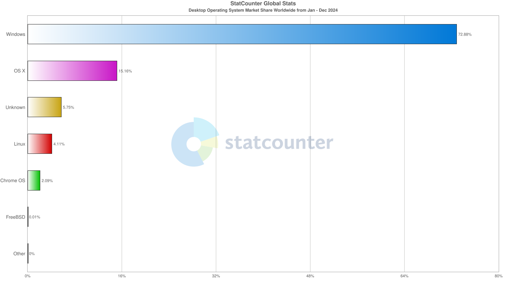

# Penny-DOS Overview.

*last updated on 11/13/2025 @ 15:00 (EST)*

## What is Penny-DOS?

Penny-DOS is the Free and Open Source (*FOSS*) MS-DOS Clone! But first, what even is MS-DOS? MS-DOS stands for "Microsoft Disk Operating System". Microsoft is known to keep most of their OS code closed source, Keeping all of the code to themselves. This means nobody other than Microsoft and Microsoft's employees have the code. However some of their programs and **some older** operating systems are open source.

The following are some of microsoft's MOST POPULAR open source projects + their licence.

- [MS-DOS](https://github.com/microsoft/MS-DOS) (MIT Licence)

    - NOW ARCHIVED: Only versions 1.25, 2.0, and 4.0 are avaliable.

- [VS Code](https://github.com/microsoft/vscode) (MIT Licence)
- [WSL](https://github.com/microsoft/WSL) (MIT Licence)

### Why is this relevant to this project?

In a nutshell, this is relevant to Penny-DOS for 1 big reason. Nostalgia. People love to go back to the "Good Ol' Days" and enjoy themselves, re-live their childhood, or even re-live a nw childhood. However, many tech nerds like me and you (*possibly*) love to dive right into the code, and just tweak it to our own needs, However with newer releases of Microsoft Windows (7, 8, 10, & 11) do not let you do this. Why? According to a quick google search, "because it is a proprietary product that generates revenue". They want MONEY, MONEY, MONEY!!

Then again if microsoft were to be an open source nonprofit like linux we would not be where we are with tech today, at all. We would have evloved differently, tech wise. We wouldnt have products like the XBOX, microsoft azure, so on so forth. Not to mention the people who dedicated over 33 years to microsoft and then being laid off in 2024, (Jeff Bogdan).

These people who spent Months, to YEARS of their lives working at Microsoft most likely wouldn't be where they are today, and that also goes for microsoft. 

According to [This Website](https://gs.statcounter.com/os-market-share/desktop/worldwide/#monthly-202401-202412-bar) The current market share in 2024 was almost 73% windows!

I will stop ranting about windows now.

#### My chart

## The End.